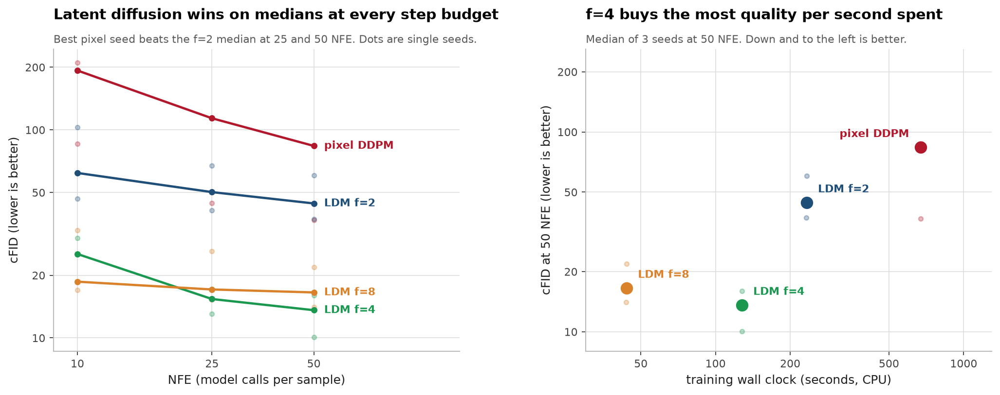
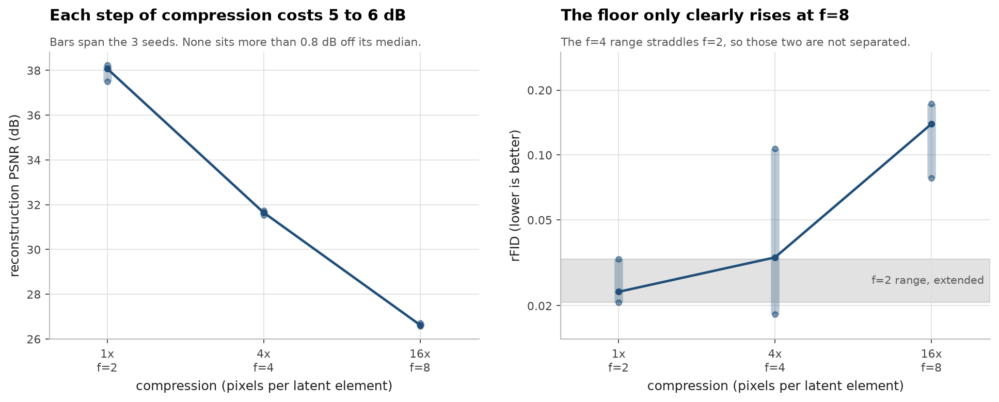
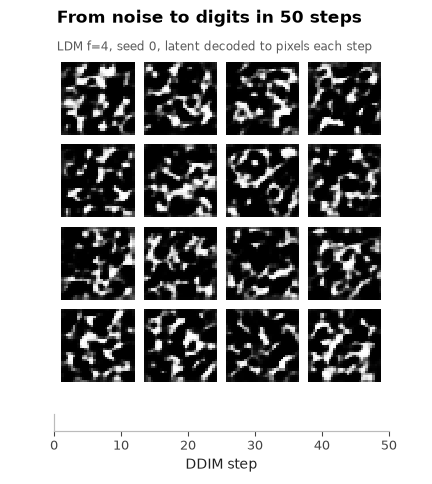
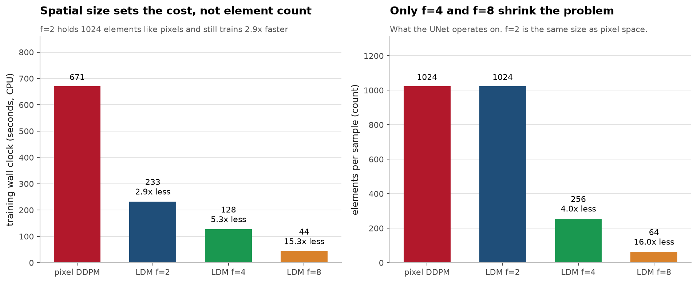

# latent-diffusion-from-scratch

[](https://github.com/aghasalim/latent-diffusion-from-scratch/actions/workflows/ci.yml)
[](https://www.python.org/)
[](LICENSE)
[](results/)

A KL-regularised autoencoder, a DDPM, and the comparison the LDM paper is about:
running diffusion in a compressed latent instead of in pixels. MNIST at 32x32 on
a laptop CPU, three seeds, about 100 minutes end to end.

The headline: at a matched step count, diffusion in a 4x compressed latent
trains **5.3x faster** than the pixel baseline and reaches **6.2x better** sample
quality. At 16x compression it is **15.3x faster** and still 5.1x better.



## The claim being tested

Pixel diffusion spends its capacity modelling texture. The LDM factorisation
splits the problem: an autoencoder handles perceptual compression, and the
diffusion model handles composition in the smaller space. Everything about the
diffusion model is held fixed here, the same UNet, the same cosine schedule, the
same DDIM sampler, the same number of training steps, so the only variable is
where the diffusion happens.

The knob is the downsampling factor f. Compress too little and stage two is
expensive. Compress too much and the decoder throws away detail no diffusion
model above it can recover. Finding where that trade sits is the actual subject.

## Stage one: what the autoencoder costs

Median of 3 seeds, with the seed range for rFID because it is much noisier than
the reconstruction error beside it.

| f | latent | compression | recon PSNR | rFID | rFID range over seeds | AE train |
|---:|---|---:|---:|---:|---|---:|
| 2 | (4, 16, 16) | 1.0x | 38.08 dB | 0.023 | 0.021 to 0.033 | 193 s |
| 4 | (4, 8, 8) | 4.0x | 31.65 dB | 0.034 | 0.018 to 0.107 | 245 s |
| 8 | (4, 4, 4) | 16.0x | 26.63 dB | 0.139 | 0.078 to 0.172 | 299 s |



rFID is reconstruction quality measured in the same feature space as the
generation metric. It is the floor: no model trained on top of this autoencoder
can produce samples better than the autoencoder's own reconstructions.

**The range column is the reason this section makes only one claim.** PSNR
spans 0.73 dB across seeds at f=2, 0.20 dB at f=4 and 0.14 dB at f=8. The f=2
spread is the widest of the three. The levels are still 5.8 dB and 4.8 dB apart
at their closest seeds, so the distortion ordering is solid. rFID is not: at
f=4 the three seeds span 0.018 to 0.107, a factor of 5.9, and that interval
sits entirely across f=2's. So **f=2 and f=4 are not separated by rFID** and it
would be wrong to read the medians 0.023 and 0.034 as a rise.

f=8 is a different matter. Its range, 0.078 to 0.172, does not overlap f=2's at
all, so the floor genuinely rises there, and that is where compression starts to
cost something real. One claim, and the numbers that support it are in the table
rather than behind a median.

f=2 is a useful control. It has four latent channels at half resolution, which
works out to 1.0x compression, so it is a latent space that is not actually
smaller. It still beats pixel diffusion on the median at every step budget,
which says part of the benefit comes from the latent being a smoother, more
Gaussian space to diffuse in, not only from having fewer elements. The seeds
overlap though. At 50 NFE the best pixel run is better than all three f=2 runs,
so f=2 against pixel is the weakest comparison in stage two. f=4 and f=8 do not
overlap pixel at any budget.

## Stage two: quality against cost

Median of 3 seeds. Identical UNet, schedule and sampler throughout.

| model | elements per sample | train | cFID@10 | cFID@25 | cFID@50 | sW2@50 |
|---|---:|---:|---:|---:|---:|---:|
| pixel DDPM | 1024 | 671 s | 192.90 | 113.67 | 83.71 | 0.1759 |
| LDM f=2 | 1024 | 233 s | 62.06 | 50.21 | 44.29 | 0.1102 |
| **LDM f=4** | 256 | 128 s | 25.31 | 15.38 | **13.59** | **0.0802** |
| LDM f=8 | 64 | 44 s | 18.63 | 17.09 | 16.54 | 0.1008 |



This is the f=4 row of that table being produced: 16 samples, seed 0, DDIM at 50
steps, the latent decoded to pixels after every step. The model, the schedule and
the starting noise are fixed, and only the step index moves. A few of the sixteen
never land on a digit. That is what a cFID of 13.59 looks like up close.



Full detail in [notes/METHODS.md](notes/METHODS.md#stage-two-quality-against-cost).
## Metrics, named honestly
Standard FID uses InceptionV3 features trained on ImageNet, which is the wrong feature extractor for 32x32 grayscale digits, and pulling it in would produce a number that does not mean what its name implies.

Full detail in [notes/METHODS.md](notes/METHODS.md#metrics-named-honestly).
## What I got wrong
**The UNet skip connections were misaligned and I did not notice from the shapes.** The first version reconstructed skip channel counts from the multiplier list rather than recording them on the way down.

Full detail in [notes/METHODS.md](notes/METHODS.md#what-i-got-wrong).
## Limitations

- No perceptual or adversarial loss in stage one. The paper uses both, and their
  absence is why reconstructions here are blurry at high f in a way LPIPS would
  punish more than MSE does.
- MNIST at 32x32 is a long way from 256x256 faces. The mechanism should transfer;
  the numbers will not.
- 1200 diffusion steps is short. The pixel baseline in particular is undertrained.
- No conditioning, no classifier-free guidance, no cross attention. This is
  unconditional generation only.

## Running it

```bash
python -m venv .venv && source .venv/bin/activate
pip install -r requirements.txt
```

```bash
python -m pytest tests/ -q
```

```bash
python -m experiments.main --seeds 0 1 2 --fs 2 4 8 --n 15000 --ae-steps 1000 --dm-steps 1200 --eval-n 750
```

```bash
python -m bench.figures
```

The sweep takes about 100 minutes on an M4 CPU and writes `results/stage1.csv`
and `results/stage2.csv`. The plots read those files and never re-run an
experiment, so a plot cannot disagree with a number in this README.

The animation is the one exception, because a sampling trajectory is not in a
table. It retrains the f=4 pair at seed 0 with the settings recorded in
`results/run-meta.json`, which takes about six minutes, then caches the frames
next to the figures. It writes no CSV.

MNIST is downloaded to `data/` on first use.

## Layout

```
ldm/data.py         MNIST padded to 32x32 so f=2,4,8 all divide evenly
ldm/autoencoder.py  KL-regularised autoencoder, the compression knob
ldm/unet.py         epsilon predictor, identical in both spaces
ldm/diffusion.py    cosine schedule, DDPM training, DDIM sampling
ldm/metrics.py      cFID and sliced W2, both named for what they are
experiments/main.py the sweep
tests/              33 tests
```

## Sources

- **Rombach, Blattmann, Lorenz, Esser, Ommer. High-Resolution Image Synthesis with Latent Diffusion Models. CVPR 2022.** [arXiv:2112.10752](https://arxiv.org/abs/2112.10752) The factorisation this repo tests, and the f ablation in section 4.1.
- **Ho, Jain, Abbeel. Denoising Diffusion Probabilistic Models. NeurIPS 2020.** [arXiv:2006.11239](https://arxiv.org/abs/2006.11239) The training objective.
- **Song, Meng, Ermon. Denoising Diffusion Implicit Models. ICLR 2021.** [arXiv:2010.02502](https://arxiv.org/abs/2010.02502) DDIM, which is what makes a small NFE budget meaningful.
- **Nichol, Dhariwal. Improved Denoising Diffusion Probabilistic Models. ICML 2021.** [arXiv:2102.09672](https://arxiv.org/abs/2102.09672) The cosine schedule used here.
- **Esser, Rombach, Ommer. Taming Transformers for High-Resolution Image Synthesis. CVPR 2021.** [arXiv:2012.09841](https://arxiv.org/abs/2012.09841) The first-stage autoencoder design, including why the KL weight is tiny.
- **Heusel, Ramsauer, Unterthiner, Nessler, Hochreiter. GANs Trained by a Two Time-Scale Update Rule Converge to a Local Nash Equilibrium. NeurIPS 2017.** [arXiv:1706.08500](https://arxiv.org/abs/1706.08500) The FID formula, applied here to different features and renamed accordingly.
- MNIST from the CVDF mirror of LeCun's dataset.

Related: [rectified-flow-from-scratch](https://github.com/aghasalim/rectified-flow-from-scratch)
is the same generative problem with a straight interpolant instead of a diffusion path.

## Methodology

The rules this follows are in [`METHODOLOGY.md`](METHODOLOGY.md). Rule 8, no number that did not
come from a measurement, and rule 15, say what was not measured, are why the
limitations section is as long as it is.

## Author

Aghasalim Mustafazada, third year AI student at Howest, Belgium.

<p align="center">
  <a href="https://github.com/aghasalim">
    </a>
  <a href="https://www.kaggle.com/aghasalimmustafazada">
    </a>
  <a href="https://linkedin.com/in/mustafazada">
    </a>
  <a href="https://orcid.org/0009-0001-8746-4582">
    </a>
</p>

## License

MIT, see [LICENSE](LICENSE).
